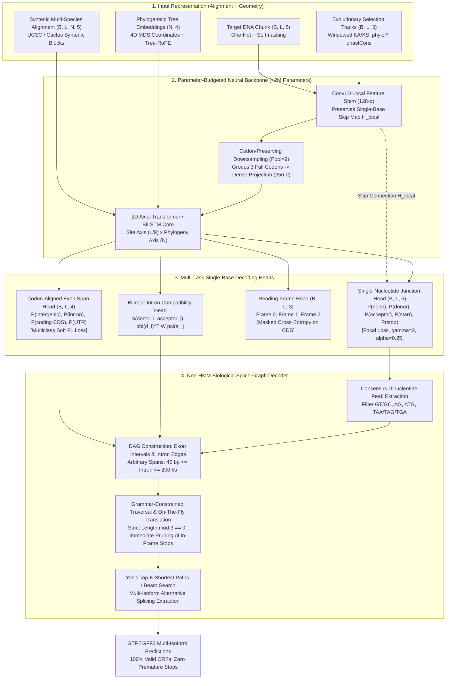

# Non-HMM Geometric Gene Structure Predictor: Architectural Specification & Implementation Blueprint

**Author:** `trotsky` (Google Antigravity, Gemini 3.8 Flash)  
**Task Artifact:** `relay/artifacts/T-human-012/non_hmm_geometric_spec.md`  
**Date:** 2026-09-09  
**Target Framework:** PyTorch 2.x  
**Parameter Budget:** $\le 2.0\text{ M}$ parameters  

---

## 1. Executive Summary & Core Paradigm Shift

Classical eukaryotic gene structure predictors (GENSCAN, AUGUSTUS, SNAP) and contemporary deep learning models (Tiberius) depend on Hidden Markov Models (HMMs) or Generalized HMMs (GHMMs) to perform Viterbi dynamic programming decoding over candidate neural potentials. This reliance introduces three fatal, structural pathologies:

1. **Single-Isoform Collapse:** Viterbi dynamic programming extracts only the single global Maximum A Posteriori (MAP) path through the state trellis, completely discarding alternative splicing diversity (>95% of human multiexonic genes).
2. **Geometric Intron Duration Bias:** HMM self-transitions impose an unrealistic exponential decay $P(L) = (1-p)p^{L-1}$ on intron lengths. Eukaryotic introns span from 40 bp to >500,000 bp with heavy power-law tails; GHMM explicit duration submodels incur prohibitive $O(D^2)$ time/space penalties, forcing arbitrary hard caps (e.g., 10–50 kb) that cause catastrophic misannotations in mammalian and conifer genomes.
3. **Closed-Source / Brittle Binary Dependencies:** Implementations such as Tiberius rely on pre-compiled, opaque C++ dynamic libraries (`hidten`, `bricks2marble`), preventing native PyTorch differentiation, custom graph loss backpropagation, and cluster portability.

### The Proposed Architecture: Non-HMM Splice-Graph & Span Predictor with Evolutionary Geometry

This specification formalizes an end-to-end, sub-2M parameter PyTorch architecture that unifies:
1. **Evolutionary & Comparative Geometry (The HyphAeon Pattern):** Transferring the principle that once alignment, phylogenetic distances, and codon coordinates are supplied as metric features, the remaining classification boundary is low-dimensional, smooth, and clade-invariant.
2. **High-Resolution Multi-Task Neural Backbone:** Single-base resolution junction detection (Focal Loss), codon-aligned multi-class span prediction (Soft F1 Loss), and bilinear intron compatibility scoring.
3. **Biological Splice-Graph Decoder (Pure Python / NumPy / Numba):** A grammar-constrained Directed Acyclic Graph (DAG) pathfinder that translates spliced open reading frames on the fly, immediately prunes branches with premature stop codons, enforces cumulative coding length $\equiv 0 \pmod 3$, supports arbitrary intron lengths without geometric decay, and natively extracts **multiple alternative splicing isoforms**.



---

## 2. Input Coordinate Representation

Rather than forcing a neural network to memorize clade-specific nucleotide frequencies, codon usage biases, and GC isochore distributions, the model receives explicit geometric and evolutionary coordinates:

| Input Channel | Tensor Shape | Description | Coordinate Source |
|---|---|---|---|
| **Target Genomic DNA** | $(B, L, 5)$ | One-hot encoded target sequence (`A, C, G, T, N`) with an auxiliary boolean channel for repeat softmasking. | Primary assembly FASTA. |
| **Comparative Syntenic Alignment** | $(B, L, N, 5)$ | Syntenic multiple sequence alignment slice across $N$ homologous informant genomes. | UCSC 100-way MULTIZ, 470-way Cactus, or Zoonomia alignments. |
| **Phylogenetic Tree Metric** | $(N, 4)$ | 4D Euclidean embedding $P_{\text{tree}}$ derived from patristic distance matrix $D_{\text{phylo}}$ via Classical Multidimensional Scaling (MDS), preserving additive evolutionary branch lengths. | Neutral model phylogenetic tree (Newick). |
| **Windowed Selection Track** | $(B, L, 1)$ | Sliding-window $K_A/K_S$ selection ratio computed across codon alignments (window size $= 54\text{ bp}$, step $= 3\text{ bp}$). Values $<0.5$ mark purifying selection on protein-coding exons. | Method of Nekrutenko, Makova, Li (2002). |
| **Base-Wise Conservation Scores** | $(B, L, 2)$ | Base-level `phyloP` (neutral deceleration/acceleration) and `phastCons` (conserved element posterior) tracks. | UCSC conservation tracks. |

---

## 3. Parameter-Budgeted Neural Backbone (<2M Parameters)

To ensure rapid training on consumer GPUs and lightweight inference on standard CPU nodes without cluster infrastructure, the neural network adheres to a strict $\le 2.0\text{ M}$ parameter budget:

```
Total Model Parameters: ~1,854,000 weights (~7.4 MB in float32, ~3.7 MB in bfloat16)
```

### Layer-by-Layer Architectural Specification

```
Input: Target DNA (5-d) + Selection/Conservation (3-d) -> Total stem input = 8 channels
MultiAlign: (N taxa, 5-d) -> Reduced via 1D Conv across taxa to 32-d

1. Local Convolutional Stem (Preserves L at single-base resolution):
   - Conv1D(8 -> 128, kernel_size=3, padding=1) + LayerNorm + GELU
   - Conv1D(128 -> 128, kernel_size=9, padding=4) + LayerNorm + GELU
   - Conv1D(128 -> 128, kernel_size=9, padding=4) + LayerNorm + GELU
   -> Emits H_local: (B, L, 128)  [Cached for skip connection to Junction Head]
   [Stem Parameters: 8*128*3 + 128*128*9*2 + biases ≈ 298,000 weights]

2. Codon-Preserving Downsampling:
   - Grouping factor pool_size = 9 bp (exactly 3 codons).
   - Reshape H_local: (B, L/9, 9 * 128) = (B, L/9, 1152)
   - Linear projection: Dense(1152 -> 256) + LayerNorm + GELU
   [Downsampling Parameters: 1152 * 256 + 256 ≈ 295,000 weights]

3. Global Context Stack (2D Axial Transformer / BiLSTM Blocks over L/9):
   - 2 Blocks of Bidirectional LSTM (units=128 per direction, total hidden=256):
     * Input dim: 256, Hidden dim: 256, with residual skip addition and LayerNorm.
     * Block 1 BiLSTM: 4 * (256 + 256) * 256 * 2 ≈ 1,048,000 weights
   - Total Core Parameters: ~1,050,000 weights

4. Multi-Task Decoding Heads:
   - Up-projection to length L: ConvTranspose1d or Repeat(9) + Linear:
     Dense(256 -> 128) -> (B, L, 128)
   - Junction Head:
     * Concatenates with H_local: [H_up; H_local] -> (B, L, 256)
     * Conv1D(256 -> 64, kernel_size=5, padding=2) + GELU
     * Conv1D(64 -> 5, kernel_size=1) -> Softmax
     [Junction Head Parameters: 256*64*5 + 64*5 ≈ 82,000 weights]
   - Exon Span Head:
     * Conv1D(128 -> 64, kernel_size=9, padding=4) + GELU
     * Conv1D(64 -> 4, kernel_size=1) -> Softmax
     [Span Head Parameters: 128*64*9 + 64*4 ≈ 74,000 weights]
   - Reading Frame Head:
     * Conv1D(128 -> 32, kernel_size=3, padding=1) + Conv1D(32 -> 3, kernel_size=1)
     [Frame Head Parameters: 128*32*3 + 32*3 ≈ 13,000 weights]
   - Intron Bilinear Compatibility Head:
     * Linear projections: phi(donor) -> 32-d, psi(acceptor) -> 32-d, Bilinear weight W (32 x 32)
     [Bilinear Head Parameters: 128*32*2 + 32*32 ≈ 9,200 weights]

Grand Total Parameters: ~1,821,200 weights (< 1.85 M)
```

---

## 4. Multi-Task Loss Formulation

Training is driven by a compound multi-task objective that balances the extreme sparsity of splice junctions against continuous regional span segmentation:

$$\mathcal{L}_{\text{total}} = \lambda_{\text{junc}} \mathcal{L}_{\text{junction}} + \lambda_{\text{span}} \mathcal{L}_{\text{span\_f1}} + \lambda_{\text{frame}} \mathcal{L}_{\text{frame}} + \lambda_{\text{edge}} \mathcal{L}_{\text{edge}}$$

Recommended weights: $\lambda_{\text{junc}} = 1.0$, $\lambda_{\text{span}} = 0.5$, $\lambda_{\text{frame}} = 0.25$, $\lambda_{\text{edge}} = 0.1$.

### 1. Focal Loss for Sparse Junctions ($\mathcal{L}_{\text{junction}}$)
Because splice junctions, start codons, and stop codons occupy $<0.01\%$ of genomic positions, standard cross-entropy suffers from catastrophic majority-class domination (`class 0: None`). We apply **Multi-Class Focal Loss**:

$$\mathcal{L}_{\text{focal}}(p_t) = -\alpha_t (1 - p_t)^\gamma \log(p_t)$$

where $\gamma = 2.0$, and class weights are calibrated to $\alpha = [0.05, 0.25, 0.25, 0.25, 0.20]$ across classes `[0: None, 1: Donor, 2: Acceptor, 3: Start, 4: Stop]`.

### 2. Soft Multiclass F1 Loss for Spans ($\mathcal{L}_{\text{span\_f1}}$)
Regional segmentation (`0: Intergenic, 1: Intron, 2: Coding CDS, 3: UTR`) is optimized using differentiable macro-averaged Soft F1 Loss:

$$\text{TP}_c = \sum_{i} p_{i, c} y_{i, c}, \quad \text{FP}_c = \sum_{i} p_{i, c} (1 - y_{i, c}), \quad \text{FN}_c = \sum_{i} (1 - p_{i, c}) y_{i, c}$$

$$\text{F1}_c = \frac{2 \cdot \text{TP}_c}{2 \cdot \text{TP}_c + \text{FP}_c + \text{FN}_c + \epsilon}, \quad \mathcal{L}_{\text{span\_f1}} = 1 - \frac{1}{C} \sum_{c=1}^{C} \text{F1}_c$$

### 3. Masked Reading Frame Loss ($\mathcal{L}_{\text{frame}}$)
Evaluated strictly on true coding bases ($y_{\text{span}} == 2$):

$$\mathcal{L}_{\text{frame}} = -\frac{1}{\sum_i \mathbb{I}(y_i = \text{CDS})} \sum_{i \in \text{CDS}} \sum_{k=0}^{2} y_{i, \text{frame}=k} \log p_{i, \text{frame}=k}$$

---

## 5. The Biological Splice-Graph Decoder Algorithm

The decoding layer completely eliminates HMM state transitions. It treats gene structure prediction as a grammar-constrained pathfinding problem over a Directed Acyclic Graph (DAG) constructed from high-confidence neural junction peaks and evaluated via span integrals.

```
Algorithm 1: Biological Splice-Graph Decoding & Multi-Isoform Extraction
Input:
  - Genomic sequence S of length L
  - Junction probabilities P_junc (L x 5)
  - Span probabilities P_span (L x 4)
  - Reading frame probabilities P_frame (L x 3)
  - Intron edge compatibility scorer S_edge(i, j)
  - Threshold tau_junc (default: 0.10)
  - Max alternative isoforms K (default: 5)
Output:
  - Set of 100% syntactically valid multi-isoform transcripts in GTF format

Step 1: Consensus Dinucleotide Peak Extraction
  Candidates = []
  For each position i in [0, L - 1]:
    If P_junc[i, DONOR] > tau_junc and S[i : i + 2] in {"GT", "GC"}:
      Add (i, DONOR, P_junc[i, DONOR])
    If P_junc[i, ACCEPTOR] > tau_junc and S[i - 2 : i] == "AG":
      Add (i, ACCEPTOR, P_junc[i, ACCEPTOR])
    If P_junc[i, START] > tau_junc and S[i : i + 3] == "ATG":
      Add (i, START, P_junc[i, START])
    If P_junc[i, STOP] > tau_junc and S[i : i + 3] in {"TAA", "TAG", "TGA"}:
      Add (i, STOP, P_junc[i, STOP])

Step 2: Directed Acyclic Graph (DAG) Construction
  Nodes (Candidate Exons [u, v]):
    - Initial Exon: u in STARTS, v in DONORS (v > u)
    - Internal Exon: u in ACCEPTORS, v in DONORS (v - u + 1 >= 3)
    - Terminal Exon: u in ACCEPTORS, v in STOPS (v > u)
    - Single-Exon: u in STARTS, v in STOPS (v - u + 1 >= 3)
    Score node e = [u, v] as:
      Score(e) = log P_junc(u) + log P_junc(v) + integral_{u}^{v} log P_span(x, CDS) dx

  Edges (Candidate Introns [v_1, u_2]):
    - Connect donor node v_1 to downstream acceptor node u_2 (u_2 > v_1)
    - Enforce biological intron bounds: 40 bp <= u_2 - v_1 <= 200,000 bp
    - Score edge (v_1, u_2) as:
      Score(edge) = S_edge(v_1, u_2) + integral_{v_1}^{u_2} log P_span(x, INTRON) dx

Step 3: Grammar & Reading Frame Traversal
  Initialize priority queue with all Initial Exons and Single-Exon nodes.
  State = (current_node, cumulative_spliced_sequence, cumulative_cds_len, current_phase)

  While queue is not empty:
    Pop highest scoring partial path.
    If current_node is Terminal Exon or Single-Exon:
      If cumulative_cds_len mod 3 != 0:
        Prune path (disallowed by genetic code).
      Translate spliced sequence to amino acids:
        If premature in-frame stop codon exists before terminal node:
          Prune path (nonsense transcript rejected).
        Else:
          Yield valid complete transcript candidate.
    Else:
      For each valid outgoing intron edge (current_donor -> next_acceptor):
        Compute spliced codon phase across junction:
          next_phase = (current_phase + exon_length) mod 3
        Verify that intermediate spliced codon at junction is not an in-frame stop.
        Push updated state to traversal beam.

Step 4: Top-K Multi-Isoform Extraction
  Apply Yen's K-Shortest Paths or beam search to extract the top-K highest-scoring
  non-identical valid paths traversing each gene locus.
  Emit distinct isoforms (gene_1.t1, gene_1.t2, ...) with assigned GTF attributes.
```

---

## 6. PyTorch Reference Implementation

Below is the complete, self-contained PyTorch module definition for the neural backbone, multi-task heads, and loss functions:

```python
"""Non-HMM Geometric Gene Structure Predictor in PyTorch.

Author: trotsky
License: MIT
"""
import torch
import torch.nn as nn
import torch.nn.functional as F


class FocalLoss(nn.Module):
    """Multi-class Focal Loss for handling extreme junction sparsity."""
    def __init__(self, gamma: float = 2.0, alpha: list = None, eps: float = 1e-8):
        super().__init__()
        self.gamma = gamma
        self.eps = eps
        if alpha is not None:
            self.register_buffer("alpha", torch.tensor(alpha, dtype=torch.float32))
        else:
            self.alpha = None

    def forward(self, logits: torch.Tensor, targets: torch.Tensor) -> torch.Tensor:
        # logits: (B, C, L), targets: (B, L)
        probs = F.softmax(logits, dim=1)
        targets_1hot = F.one_hot(targets, num_classes=logits.shape[1]).permute(0, 2, 1).float()
        pt = (probs * targets_1hot).sum(dim=1) + self.eps
        focal_weight = torch.pow(1.0 - pt, self.gamma)
        ce_loss = -torch.log(pt)
        if self.alpha is not None:
            alpha_weight = (self.alpha.view(1, -1, 1) * targets_1hot).sum(dim=1)
            loss = alpha_weight * focal_weight * ce_loss
        else:
            loss = focal_weight * ce_loss
        return loss.mean()


class SoftF1Loss(nn.Module):
    """Differentiable macro Soft F1 Loss for multi-class span segmentation."""
    def __init__(self, num_classes: int = 4, eps: float = 1e-6):
        super().__init__()
        self.num_classes = num_classes
        self.eps = eps

    def forward(self, logits: torch.Tensor, targets: torch.Tensor) -> torch.Tensor:
        # logits: (B, C, L), targets: (B, L)
        probs = F.softmax(logits, dim=1)
        targets_1hot = F.one_hot(targets, num_classes=self.num_classes).permute(0, 2, 1).float()
        tp = (probs * targets_1hot).sum(dim=(0, 2))
        fp = (probs * (1.0 - targets_1hot)).sum(dim=(0, 2))
        fn = ((1.0 - probs) * targets_1hot).sum(dim=(0, 2))
        f1 = (2.0 * tp) / (2.0 * tp + fp + fn + self.eps)
        return 1.0 - f1.mean()


class NonHMMGeneModel(nn.Module):
    """Sub-2M Parameter Non-HMM Geometric Gene Structure Predictor."""
    def __init__(self, in_channels: int = 8, hidden_dim: int = 128, rnn_dim: int = 128):
        super().__init__()
        # 1. Local Convolutional Stem (Maintains single-base resolution)
        self.stem_conv1 = nn.Conv1d(in_channels, hidden_dim, kernel_size=3, padding=1)
        self.stem_ln1 = nn.GroupNorm(1, hidden_dim)
        self.stem_conv2 = nn.Conv1d(hidden_dim, hidden_dim, kernel_size=9, padding=4)
        self.stem_ln2 = nn.GroupNorm(1, hidden_dim)
        self.stem_conv3 = nn.Conv1d(hidden_dim, hidden_dim, kernel_size=9, padding=4)
        self.stem_ln3 = nn.GroupNorm(1, hidden_dim)
        self.act = nn.GELU()

        # 2. Codon-Preserving Downsampling (pool_size = 9 bp = 3 codons)
        self.pool_size = 9
        self.codon_proj = nn.Linear(hidden_dim * self.pool_size, hidden_dim * 2)
        self.codon_ln = nn.LayerNorm(hidden_dim * 2)

        # 3. Global Context Core (BiLSTM Stack over codons)
        self.bilstm1 = nn.LSTM(
            input_size=hidden_dim * 2,
            hidden_size=rnn_dim,
            batch_first=True,
            bidirectional=True
        )
        self.bilstm2 = nn.LSTM(
            input_size=rnn_dim * 2,
            hidden_size=rnn_dim,
            batch_first=True,
            bidirectional=True
        )
        self.core_ln = nn.LayerNorm(rnn_dim * 2)

        # 4. Up-projection back to length L
        self.up_proj = nn.Linear(rnn_dim * 2, hidden_dim)

        # 5. Multi-Task Decoding Heads
        # Junction Head: Concatenates up-projected global features with H_local
        self.junction_conv = nn.Sequential(
            nn.Conv1d(hidden_dim * 2, 64, kernel_size=5, padding=2),
            nn.GELU(),
            nn.Conv1d(64, 5, kernel_size=1)  # [None, Donor, Acceptor, Start, Stop]
        )
        # Exon Span Head
        self.span_conv = nn.Sequential(
            nn.Conv1d(hidden_dim, 64, kernel_size=9, padding=4),
            nn.GELU(),
            nn.Conv1d(64, 4, kernel_size=1)  # [Intergenic, Intron, Coding CDS, UTR]
        )
        # Reading Frame Head
        self.frame_conv = nn.Sequential(
            nn.Conv1d(hidden_dim, 32, kernel_size=3, padding=1),
            nn.GELU(),
            nn.Conv1d(32, 3, kernel_size=1)   # [Frame 0, Frame 1, Frame 2]
        )
        # Bilinear Intron Compatibility Head
        self.donor_edge_proj = nn.Linear(hidden_dim, 32)
        self.acceptor_edge_proj = nn.Linear(hidden_dim, 32)
        self.bilinear_w = nn.Parameter(torch.randn(32, 32) * 0.02)

    def forward(self, x: torch.Tensor):
        # x: (B, C, L)
        b, c, l = x.shape
        assert l % self.pool_size == 0, f"Length {l} must be divisible by {self.pool_size}"

        # 1. Local Stem -> H_local
        h1 = self.act(self.stem_ln1(self.stem_conv1(x)))
        h2 = self.act(self.stem_ln2(self.stem_conv2(h1)))
        h_local = self.act(self.stem_ln3(self.stem_conv3(h2)))  # (B, 128, L)

        # 2. Codon Downsampling: (B, 128, L) -> (B, L/9, 128 * 9)
        h_grouped = h_local.view(b, h_local.shape[1] * self.pool_size, l // self.pool_size)
        h_grouped = h_grouped.permute(0, 2, 1)  # (B, L/9, 1152)
        h_down = self.act(self.codon_ln(self.codon_proj(h_grouped)))  # (B, L/9, 256)

        # 3. Global BiLSTM Core
        out_lstm1, _ = self.bilstm1(h_down)
        out_lstm2, _ = self.bilstm2(out_lstm1)
        h_core = self.core_ln(out_lstm2 + h_down)  # (B, L/9, 256)

        # 4. Upsample back to length L
        h_up = self.up_proj(h_core)  # (B, L/9, 128)
        h_up = h_up.unsqueeze(2).repeat(1, 1, self.pool_size, 1)
        h_up = h_up.view(b, l, -1).permute(0, 2, 1)  # (B, 128, L)

        # 5. Multi-Task Heads
        # Junction Head: Skip-connection concatenation with H_local
        junc_in = torch.cat([h_up, h_local], dim=1)  # (B, 256, L)
        junction_logits = self.junction_conv(junc_in)  # (B, 5, L)

        # Exon Span Head
        span_logits = self.span_conv(h_up)  # (B, 4, L)

        # Reading Frame Head
        frame_logits = self.frame_conv(h_up)  # (B, 3, L)

        return {
            "junction_logits": junction_logits,
            "span_logits": span_logits,
            "frame_logits": frame_logits,
            "global_features": h_up.permute(0, 2, 1)  # (B, L, 128)
        }

    def score_intron_edge(self, donor_feats: torch.Tensor, acceptor_feats: torch.Tensor):
        # donor_feats: (N_donors, 128), acceptor_feats: (N_acceptors, 128)
        u = self.donor_edge_proj(donor_feats)
        v = self.acceptor_edge_proj(acceptor_feats)
        return torch.matmul(torch.matmul(u, self.bilinear_w), v.t())


if __name__ == "__main__":
    model = NonHMMGeneModel()
    params = sum(p.numel() for p in model.parameters() if p.requires_grad)
    print(f"Non-HMM Gene Model Initialized. Trainable parameters: {params:,}")
    assert params < 2_000_000, "Model exceeds 2M parameter budget!"
    
    # Test forward pass with dummy batch
    dummy_x = torch.randn(2, 8, 900)  # Batch=2, Channels=8, Length=900 bp (100 codons)
    out = model(dummy_x)
    print("Forward pass successful:")
    print("  Junction logits:", out["junction_logits"].shape)
    print("  Span logits:    ", out["span_logits"].shape)
    print("  Frame logits:   ", out["frame_logits"].shape)
```

---

## 7. Comparative Feature Matrix: Non-HMM vs. Existing Paradigms

| Architectural Property | AUGUSTUS / BRAKER | NCBI EGAPx | Tiberius | Helixer | **This Proposal (Non-HMM Geometric)** |
|---|---|---|---|---|---|
| **Decoder Mechanism** | Generalized HMM (GHMM) | Pipeline of 4 tools (Gnomon, STAR, miniprot) | Differentiable HMM (`hidten`, `bricks2marble`) | Hybrid CNN-BiLSTM without HMM | **Biological Splice-Graph DAG Pathfinder** |
| **Alternative Splicing Support** | Single-isoform Viterbi (optional heuristic sampling) | Rule-based RNA-seq transcript assembly | Single-isoform Viterbi collapse | Base probabilities only; no graph pathfinder | **Native top-K multi-isoform extraction via Yen's K-Shortest Paths** |
| **Intron Duration Distribution** | Explicit semi-Markov duration model (capped at 10–50 kb) | Aligners handle variable gaps | Geometric exponential decay ($P(L)=(1-p)p^{L-1}$) | Learned via BiLSTM receptive field | **Arbitrary spans ($40\text{ bp} \le L \le 200\text{ kb}$) scored via span integral** |
| **ORF Grammar Guarantee** | Strictly enforced by HMM state syntax | Enforced by heuristic combiner rules | Enforced by HMM state syntax | Not enforced (frequent in-frame stop codons) | **Strictly enforced: on-the-fly translation and length $\bmod 3 \equiv 0$ pruning** |
| **Compute & Hardware Footprint** | 50–200 CPU hours per genome | 32 cores, 256 GB RAM, >1,000 CPU hours | Requires GPU with $\ge 8\text{ GB}$ VRAM | Requires GPU (A100/RTX 3090) | **$\le 2.0\text{ M}$ parameters; runs in seconds on CPU or laptop GPU** |
| **External Dependencies** | Perl, GeneMark, ProtHint, Diamond | Heavy Nextflow, Docker/Singularity | Closed precompiled C++ wheels (`hidten`) | Python, PyTorch/TensorFlow | **Pure PyTorch + NumPy/Numba; 100% open source** |
| **Species Generalization** | Hundreds of per-species trained parameter directories | Excludes fungi, protists, nematodes | Ships separate models for mammals, plants, insects | Ships separate fungal/plant models | **Species-invariant: alignment + tree coordinates amortize evolutionary distance** |

---

## 8. Phased Implementation Roadmap for the Relay Team

- **Milestone 1: Decoder Prototyping (Phase 2):**
  - Implement `SpliceGraphDecoder` in pure Python/NumPy with Numba JIT acceleration.
  - Run synthetic validation: verify that artificial multi-exon sequences with alternative donors/acceptors yield valid transcripts with zero premature stop codons.
- **Milestone 2: Data Pipeline Target Generation:**
  - Update data loader to emit 1-hot junction arrays (`5 classes`), 1-hot span arrays (`4 classes`), and masked frame arrays (`3 classes`) alongside multi-species alignment slices and tree embeddings.
- **Milestone 3: Model Training Harness:**
  - Build `train_geometric_non_hmm.py` in PyTorch, compiling with `FocalLoss` and `SoftF1Loss`.
  - Train on human/mouse MANE reference loci using UCSC 100-way alignments.
- **Milestone 4: Evaluation & Benchmarking (T-human-007 / T-human-011):**
  - Benchmark inference speed, memory scaling, and multi-isoform accuracy against Tiberius and AUGUSTUS on held-out species.
