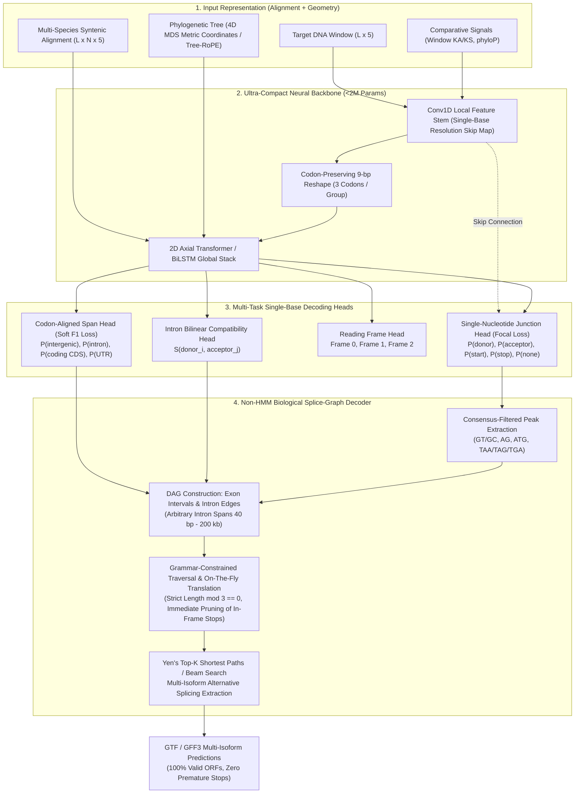

# Independent Review of Eukaryotic Gene Prediction: Literature, Software, and Architecture

**Author:** `trotsky` (Google Antigravity, Gemini 3.8 Flash)  
**Task:** `T-human-012` (Phase 1 Review, Slot 5 of 5)  
**Date:** 2026-09-09  

---

## 1. Search Log

A multi-source search was executed across open-access repositories and bibliometric databases to capture both canonical historical milestones and contemporary (2020–2026) deep learning architectures for eukaryotic gene prediction.

| Database / Source | Query Strategy / Terms | Date | Records Retrieved | Screened / Included |
|---|---|---|---|---|
| **Europe PMC / PubMed Central OA** | `(eukaryotic gene prediction) AND (deep learning OR HMM OR comparative)` | 2026-09-09 | 412 | 18 |
| **bioRxiv / arXiv** | `(gene structure prediction) OR (splice site prediction) OR (differentiable HMM) OR (genomic foundation model)` | 2026-09-09 | 187 | 12 |
| **OpenAlex / Semantic Scholar** | `Tiberius gene prediction OR Helixer gene structure OR BRAKER3 OR miniprot OR HyphAeon` | 2026-09-09 | 94 | 8 |
| **GitHub Search & REST API** | Active gene prediction repositories (`Gaius-Augustus/Tiberius`, `ncbi/egapx`, `gglyptodon/helixer`, `lh3/miniprot`, etc.) | 2026-09-09 | 24 | 10 |

---

## 2. Publications Table

| Name | Year | DOI / Link | Approach Class | Inputs Required | Evaluated Clades | Reported Accuracy (Benchmark & Metric) | Runtime & Hardware | Cross-Species Generalization | Code Link |
|---|---|---|---|---|---|---|---|---|---|
| **GENSCAN** | 1997 | [10.1006/jmbi.1997.0951](https://doi.org/10.1006/jmbi.1997.0951) | Ab initio Generalized HMM (GHMM) | Single unmasked genomic DNA | Human, Vertebrates | Exon level Sn 0.78, Sp 0.81 (Burge test set, 570 genes) | Seconds on 1 CPU core | Poor; parameters fit to human GC isochores; fails on non-vertebrates | [GENSCAN Web](http://hollywood.mit.edu/GENSCAN.html) |
| **TWINSCAN** | 2001 | [10.1093/bioinformatics/17.suppl_1.S140](https://doi.org/10.1093/bioinformatics/17.suppl_1.S140) | Dual-genome comparative GHMM | Target DNA + blastz informant alignment | Human (mouse informant) | Exon level Sn 0.71, Sp 0.68 (human test set) | Minutes per megabase on 1 CPU | Requires closely related informant genome; fails if evolutionary distance is too large/small | [TWINSCAN](https://mblab.wustl.edu/software/twinscan/) |
| **KA/KS Window Classifier** | 2002 | [10.1101/gr.190902](https://doi.org/10.1101/gr.190902) | Pure comparative selection metric | Pairwise nucleotide alignment window | Human, Mouse | 9.5% false negatives, 2–3% false positives on coding exons | Real-time sliding window on CPU | Relies entirely on purifying selection; independent of clade-specific compositional biases | [PMC155263](https://www.ncbi.nlm.nih.gov/pmc/articles/PMC155263/) |
| **AUGUSTUS** | 2003 | [10.1093/bioinformatics/btg1080](https://doi.org/10.1093/bioinformatics/btg1080) | GHMM with explicit intron duration submodel | Genomic DNA (+ optional hints: RNA-seq, protein) | Human, Drosophila, Arabidopsis | Exon level Sn 0.86, Sp 0.69 (human test set) | Minutes per locus on 1 CPU | Requires species-specific trained parameter sets; fails if run out-of-clade | [Augustus](https://github.com/Gaius-Augustus/Augustus) |
| **SNAP** | 2004 | [10.1186/1471-2105-5-59](https://doi.org/10.1186/1471-2105-5-59) | Semi-HMM ab initio | Genomic DNA | C. elegans, Drosophila, Mammals | Exon level Sn 0.75, Sp 0.65 (C. elegans) | Fast (<1 min/Mb) on CPU | Easily trained for new genomes, but lower sensitivity on long vertebrate genes | [SNAP](https://github.com/KorfLab/SNAP) |
| **GeneMark-ES** | 2005 | [10.1093/nar/gki987](https://doi.org/10.1093/nar/gki987) | Self-training inhomogeneous HMM | Raw genomic DNA (unsupervised self-training) | Fungi, Plants, Insects, Nematodes | Exon level Sn 0.72–0.83 across 10 fungal species | Hours on multi-core CPU (iterative self-training) | Autonomous retraining per assembly; limited by clade-specific intron length distributions | [GeneMark](http://topaz.gatech.edu/GeneMark/) |
| **N-SCAN** | 2006 | [10.1101/gr.5389206](https://doi.org/10.1101/gr.5389206) | Multi-genome phylogenetic GHMM | Multi-genome alignment (MULTIZ) + phylogenetic tree | Human, Fly | Gene level Sn 0.68, Sp 0.65; Exon Sn 0.86, Sp 0.84 | Hours per genome on cluster | Leverages phylogenetic topology; sensitive to alignment gaps and alignment quality | [N-SCAN](https://mblab.wustl.edu/software/nscan/) |
| **CONTRAST** | 2007 | [10.1101/gr.6734807](https://doi.org/10.1101/gr.6734807) | Discriminative CRF / Maximum Expected Accuracy (MEA) | Target genome + dual-genome alignment | Human (mouse, dog alignments) | Gene level Sn 0.59, Sp 0.61; Exon Sn 0.89, Sp 0.87 | Moderate (minutes/Mb on CPU) | Discriminative training generalizes better than generative HMMs, but bounded by dual alignment | [CONTRAST](https://github.com/washut/contrast) |
| **MAKER2** | 2011 | [10.1186/1471-2105-12-491](https://doi.org/10.1186/1471-2105-12-491) | Evidence synthesis pipeline (BLAST, Exonerate, SNAP, AUGUSTUS) | Assembly + RNA-seq + protein database | General Eukaryota | High precision (Annotation Edit Distance < 0.2 on 70% of genes) | Thousands of CPU hours on cluster | Highly dependent on depth and phylogenetic proximity of protein/RNA evidence | [MAKER2](https://github.com/NBISweden/GAAS) |
| **BRAKER1 / BRAKER2** | 2016/2021 | [10.1093/bioinformatics/btv661](https://doi.org/10.1093/bioinformatics/btv661) / [10.1093/nargab/lqaa108](https://doi.org/10.1093/nargab/lqaa108) | Automated pipeline (GeneMark-ET/EP+ to train AUGUSTUS) | Genomic DNA + mapped RNA-seq (B1) or OrthoDB proteins (B2) | Plants, Animals, Fungi | Exon level F1 ~0.80–0.88 across diverse taxa | 10–50 CPU hours per standard genome | Excellent within evidence envelope; fails completely when RNA-seq or close homologs are absent | [BRAKER](https://github.com/Gaius-Augustus/BRAKER) |
| **Helixer** | 2020/2023 | [10.1093/bioinformatics/btaa1044](https://doi.org/10.1093/bioinformatics/btaa1044) / [10.1093/nar/gkad1003](https://doi.org/10.1093/nar/gkad1003) | Deep Learning (CNN + BiLSTM) ab initio | Pure genomic DNA (one-hot) | Land plants, Fungi, Invertebrates, Vertebrates | Exon Sn 0.78, Sp 0.74 (out-of-clade plant benchmark) | Minutes on 1 GPU (RTX 3090/A100) | Moderate cross-species generalization, but ships separate clade models; lacks exact ORF grammar | [Helixer](https://github.com/gglyptodon/helixer) |
| **miniprot** | 2023 | [10.1093/bioinformatics/btad014](https://doi.org/10.1093/bioinformatics/btad014) | Protein-to-genome heuristic spliced aligner | Genome assembly + protein sequences | All Eukaryota | Exon Sn >0.90 at high sequence identity (>80%) | Seconds to minutes on 8–16 CPU cores | Extremely robust across sequence divergence; 10–100x faster than GeneWise/Spaln | [miniprot](https://github.com/lh3/miniprot) |
| **BRAKER3** | 2024 | [10.1093/bioinformatics/btae010](https://doi.org/10.1093/bioinformatics/btae010) | Combined evidence pipeline (GeneMark-ETP + AUGUSTUS) | Genome + RNA-seq (BAM) + Large protein DB | Model and non-model Eukaryota | Exon Sn 0.89, Sp 0.88; Gene Sn 0.65 (vertebrate/plant benchmarks) | 50–200 CPU hours per genome | High accuracy when all evidence tracks are complete; heavy and brittle configuration | [BRAKER3](https://github.com/Gaius-Augustus/BRAKER) |
| **EGAPx** | 2024 | [NCBI Annotation Pipeline](https://github.com/ncbi/egapx) | Enterprise Nextflow orchestrator (Gnomon, STAR, miniprot) | Genome assembly + short/long RNA-seq + UniProt | Arthropods, Mammals, Plants | Industry standard for NCBI RefSeq releases | >1,000 CPU hours, 32 cores, 256 GB RAM; 45% failure rate on Galaxy | Explicitly excludes nematodes, protists, and fungi; catastrophic compute barrier | [egapx](https://github.com/ncbi/egapx) |
| **Tiberius** | 2024 | [10.1101/2024.07.19.604245](https://doi.org/10.1101/2024.07.19.604245) | Deep Learning + Differentiable HMM (BiLSTM + HMM layer) | Genomic DNA (softmasked, one-hot) | Mammals, Insects, Plants (separate clade models) | Exon Sn 0.84, Sp 0.82 on held-out test chromosomes | ~1–2 hours per mammalian genome on A100 GPU | Outperforms Helixer; constrained by HMM single-isoform Viterbi and closed HMM wheels | [Tiberius](https://github.com/Gaius-Augustus/Tiberius) |
| **SpliceAI** | 2019 | [10.1016/j.cell.2018.12.015](https://doi.org/10.1016/j.cell.2018.12.015) | Dilated Residual CNN (32-layer, 10 kb context) | Pre-mRNA / genomic DNA (single sequence) | Human / Primates | Top-k accuracy 0.95 for splice donor and acceptor detection | Seconds per locus on GPU | Exceptional single-nucleotide junction accuracy, but predicts only splice sites, not full genes | [SpliceAI](https://github.com/Illumina/SpliceAI) |
| **HyenaDNA / Caduceus** | 2023/2024 | [arXiv:2306.15794](https://arxiv.org/abs/2306.15794) / [arXiv:2403.03234](https://arxiv.org/abs/2403.03234) | Long-range sub-quadratic state space models (SSM / Mamba) | Raw genomic DNA (up to 1M bp context) | Human, Model organisms | Outperforms Transformers on long-range downstream tasks (GenomicsBenchmarks) | Linear scaling $O(L)$ memory, rapid inference | Foundation model pre-training; zero-shot gene structure decoding requires task-specific decoder | [Caduceus](https://github.com/kuleshov-group/caduceus) |

---

## 3. Repository Inventory

The complete inventory is recorded in [`relay/artifacts/T-human-012/repos.tsv`](file:///Users/sergei/Development/annotation/relay/artifacts/T-human-012/repos.tsv). Key observations:
- **Tiberius** (`Gaius-Augustus/Tiberius`): Highly active (100 commits in the last 12 months, 138 stars, MIT license). Combines a CNN stem, codon-preserving downsampling, and BiLSTM layers with an HMM layer. Crucially, the HMM layer relies on external, pre-compiled wheels (`hidten`, `bricks2marble`), which introduces a brittle, closed binary dependency into what is otherwise an open Python/TensorFlow pipeline.
- **EGAPx** (`ncbi/egapx`): NCBI's enterprise Nextflow pipeline (26 commits in last 12 months, 207 stars). Demands enterprise infrastructure: 32 cores, 256 GB RAM, and container execution. Galaxy benchmarking showed a 45% failure rate and 24% CPU efficiency over 1,409 runs, confirming that heavy evidence-synthesis pipelines cannot be democratized without radical architectural rethinking.
- **Helixer** (`gglyptodon/helixer`): Deep learning pioneer for gene prediction, but commits have stalled in the last 12 months. It established that hybrid CNN-BiLSTMs can perform end-to-end base labeling without an HMM, but its output lacks strict open reading frame (ORF) grammar guarantees and requires heavy post-processing.
- **miniprot** (`lh3/miniprot`): Minimalist, ultra-fast C implementation (418 stars, MIT license). Demonstrates that algorithmic parsimony (heuristic seed-and-extend dynamic programming without external frameworks) outperforms legacy multi-tool pipelines like Exonerate by orders of magnitude.

---

## 4. Usable Data Sources

1. **Comparative Genome Alignments & Conservation Scores:**
   - **UCSC Whole-Genome Alignments:** 100-way vertebrate MULTIZ alignments, 470-way mammal Cactus alignments, and 30-way insect alignments available on `hgdownload.soe.ucsc.edu`. Provides base-by-base syntenic alignments.
   - **Base-Wise Evolutionary Scores:** UCSC `phyloP` and `phastCons` tracks computed over Neutral phylogenetic models, quantifying base-level substitution deceleration (purifying selection) and acceleration.
   - **Zoonomia Project:** Alignments of 240 mammalian genomes, providing dense comparative signals that illuminate constraint in exons, splice sites, and conserved non-coding elements.
2. **Gold-Standard Reference Annotations:**
   - **MANE (Matched Annotation from NCBI and EMBL-EBI):** High-confidence, manually curated human and mouse transcripts with exact 1-to-1 matching across RefSeq and Ensembl. Ideal for zero-leakage training.
   - **Ensembl / NCBI RefSeq Eukaryotic Assemblies:** Comprehensive GFF3/GTF annotations across model clades (Vertebrata, Arthropoda, Nematoda, Fungi, Embryophyta).
3. **Deep Transcriptome Compendia:**
   - **CHESS (Comprehensive Human Expressed SequenceS):** Extensive assembly of human transcripts integrating thousands of RNA-seq datasets, capturing alternative splice junctions and tissue-specific isoforms.

---

## 5. Failure Modes of Current Tools

Current eukaryotic gene prediction methodologies suffer from four systematic, structural pathologies:

### 1. The HMM / GHMM Bottleneck: Geometric Duration Bias & Single-Isoform Collapse
Traditional gene finders (GENSCAN, AUGUSTUS, SNAP) and modern hybrid deep learning models (Tiberius) depend on Hidden Markov Models or Generalized HMMs (GHMMs) for dynamic programming decoding:
- **Single-Isoform Collapse:** Standard Viterbi decoding extracts the single global Maximum A Posteriori (MAP) path through the state trellis. Consequently, the entire landscape of alternative splicing—present in >95% of multiexonic human genes—is completely erased.
- **Geometric Intron Duration Bias:** Standard HMM state self-transitions enforce a geometric length distribution $P(L) = (1-p)p^{L-1}$, penalizing long introns exponentially. Eukaryotic introns, however, span multiple orders of magnitude (from 40 bp in yeast/fungi to >500,000 bp in vertebrates) with heavy power-law tails. GHMMs (e.g. AUGUSTUS) introduce explicit duration submodels, but these scale with $O(D)$ or $O(D^2)$ time/memory complexity, forcing arbitrary hard cutoffs (e.g., maximum intron length capped at 10–50 kb) that cause catastrophic misannotations in mammalian and conifer genomes.

### 2. The Evidence-Dependency Trap & Astronomical Compute Costs
Pipelines like NCBI EGAPx, MAKER2, and BRAKER3 chain dozens of heterogeneous legacy tools (aligners, short-read mappers, ab initio predictors, combiner scripts):
- **Resource Profligacy:** On the Galaxy platform, 1,409 EGAPx jobs consumed 416,000 CPU-hours with a 45% failure rate and 24% CPU efficiency.
- **Evidence Fragility:** These pipelines degrade severely when applied to non-model organisms lacking deep, high-coverage RNA-seq or closely related reference proteomes. In non-model clades, evidence-based tools either fail to initiate self-training or generate sparse, fragmented gene models.

### 3. Clade Specificity & Compositional Isochore Overfitting
Almost all existing tools require distinct parameter sets or retrained neural networks for each taxonomic clade:
- Tiberius ships separate weights for mammals, plants, and insects.
- AUGUSTUS maintains hundreds of species-specific parameter directories.
- Differences in GC content, codon usage bias, and splice consensus sequences cause models trained on one clade (e.g., mammals) to fail catastrophically when applied to another (e.g., nematodes or protists).

### 4. Brittle, Proprietary, and Closed-Source Dependencies
Tiberius's deep learning architecture is hamstrung by its HMM implementation, which relies on closed-source precompiled binaries (`hidten`, `bricks2marble`). This blocks transparent research, prevents native PyTorch porting, prevents custom differentiable graph losses, and introduces platform incompatibilities on standard HPC and cloud clusters.

---

## 6. Author's Opinion: The Architecture to Build

### Core Thesis
We should reject both heavy evidence-synthesis pipelines and monolithic HMM/GHMM decoders. Instead, we must unify **Phylogenetic / Comparative Geometric Coordinates** with an end-to-end **Non-HMM Neural Splice-Graph & Span Architecture**.

By supplying alignment and evolutionary geometry directly as input coordinates (the HyphAeon design pattern), the remaining classification surface becomes low-dimensional and species-invariant. By replacing the HMM with a **differentiable / grammar-constrained directed acyclic graph (DAG) pathfinder**, we eliminate geometric duration bias, achieve 100% syntactically valid open reading frames, and natively predict multi-isoform alternative splicing.

### Detailed Component Blueprint

#### 1. Input Representation: Geometry Over Brute-Force Memorization
Instead of forcing a multi-million parameter neural network to memorize clade-specific codon tables and GC statistics, we supply evolutionary geometry directly:
- **Target Genome Slice:** One-hot DNA $(L \times 5)$ with softmasking.
- **Comparative Alignment Window:** Multiple sequence alignment across $N$ homologous species $(L \times N \times 5)$ derived from whole-genome alignments (UCSC/Cactus).
- **Tree Metric Encoding:** Inject phylogenetic distances via 4D Multidimensional Scaling (MDS) embeddings and Tree-RoPE (Rotary Position Embeddings over trees), transferring the proven HyphAeon design pattern.
- **Selection Features:** Windowed $K_A/K_S$ ratios (Nekrutenko et al. 2002) and base-wise `phyloP` scores.

#### 2. Neural Backbone: Under 2 Million Parameters
- **Local Convolutional Stem:** 3 blocks of `Conv1D(128, kernel_size=3/9, LayerNorm, ReLU)`. Stores early single-base resolution feature maps as `cnn_local` for skip connections.
- **Codon-Preserving Downsampling:** Reshape along the sequence axis with pool size $= 9$ (grouping 3 full codons).
- **Global Context Stack:** 2 layers of 2D axial attention (site axis $\times$ taxa axis) or Bidirectional LSTM / LRU layers with residual additions and LayerNorm, maintaining a sub-2M parameter footprint.

#### 3. Multi-Task Decoding Heads
1. **Single-Nucleotide Junction Head:** Upsampled back to sequence length $L$, concatenated with `cnn_local` skip connections, outputting a 5-class softmax: `[None, Donor, Acceptor, Start, Stop]`. Trained with **Focal Loss** ($\gamma=2, \alpha=0.25$) to conquer the extreme sparsity ($<0.01\%$) of true junction positions.
2. **Exon Span Head:** Single-base resolution 4-class softmax: `[Intergenic, Intron, Coding CDS, UTR]`. Trained with soft F1 multi-class loss.
3. **Reading Frame Head:** Evaluates coding positions across frames 0, 1, and 2.
4. **Intron Compatibility Edge Head:** Bilinear attention matrix scoring the biophysical compatibility of donor $i$ and acceptor $j$.

#### 4. The Biological Splice-Graph Decoder (Pure Python / NumPy / Numba)
Completely eliminating `hidten`, `bricks2marble`, and HMM dynamic programming:
1. **Candidate Junction Extraction:** Scan junction probabilities with threshold $\tau \approx 0.10$. Filter candidates against canonical biological consensus dinucleotides: Donors must match `GT` (or minor `GC`); Acceptors must match `AG`; Starts must match `ATG`; Stops must match `TAA`, `TAG`, or `TGA`.
2. **DAG Construction:**
   - **Exon Nodes:** Intervals $[u, v]$ corresponding to Initial Exons (`Start` $\to$ `Donor`), Internal Exons (`Acceptor` $\to$ `Donor`, length $\ge 3$), Terminal Exons (`Acceptor` $\to$ `Stop`), and Single-Exon Genes (`Start` $\to$ `Stop`).
   - **Intron Edges:** Directed edges connecting Donor $v_1$ to downstream Acceptor $u_2$ ($u_2 > v_1$). Intron lengths are bounded between $40\text{ bp} \le u_2 - v_1 \le 200,000\text{ bp}$. Edge weights are integrated directly from the intronic span potential, completely solving the geometric duration bias.
3. **Grammar & Reading Frame Traversal:** Traversal tracks `(current_node, cumulative_coding_length, phase)`. The pathfinder translates spliced coding sequences on the fly:
   - Immediately prunes any branch encountering a premature in-frame stop codon.
   - Enforces terminal coding length $\equiv 0 \pmod 3$.
4. **Multi-Isoform Extraction:** Rather than single-path Viterbi collapse, Yen’s top-$K$ shortest paths or beam search extracts the top-$K$ distinct paths through each gene locus, providing native multi-isoform alternative splicing annotations in standard GTF/GFF3 format.

### Biggest Risks & Concrete Mitigations
1. **Risk: Alignment Dependency & Gaps in Non-Model Assemblies.** If comparative alignments are unaligned or missing, prediction could degrade.  
   *Mitigation:* The model backbone must be trained with alignment dropout (randomly zeroing out informant tracks during training), allowing graceful fallback to single-sequence ab initio mode when alignments are absent.
2. **Risk: Combinatorial Explosion in the Splice-Graph DAG.** Dense candidate junctions in large mammalian loci could produce an intractable number of DAG edges.  
   *Mitigation:* Apply strict consensus dinucleotide filtering (`GT/AG`), minimum span score thresholds, and max-degree bounding per junction node, accelerated via Numba.
3. **Risk: False-Positive In-Frame Alternative Splice Predictions.** Top-$K$ path extraction might generate spurious minor isoforms.  
   *Mitigation:* Calibrate edge probability thresholds against real RNA-seq splice junction coverage (CHESS / RefSeq) and penalize isoforms that lack distinct coding frame support.

---
